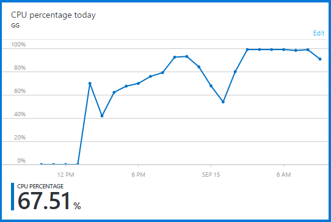
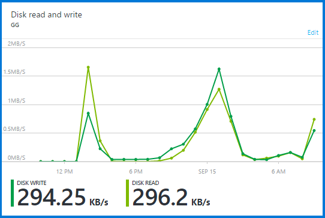
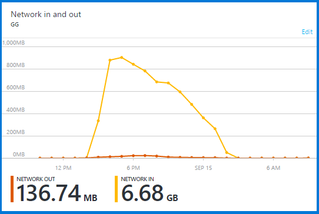

# Cloud idea

In order to cover more ground and gather larger amounts of data than is currently possible, a cloud solution is sought.

## AWS

Amazon Web Services (AWS) offers scalable cloud computing and storage solutions. The simplest step seems to be creating a [free account which offers some amount of free usage](http://aws.amazon.com/free/), however it can only be used by providing credit card/bank account details, and preparing to be billed unexpectedly by exceeding the free limits of the service. A big nasty [thread states that there is apparently no service for limiting the budget for AWS](https://forums.aws.amazon.com/thread.jspa?threadID=58127) for a few years, and therefore it is possible that without great care, the price of services used can skyrocket (since services are scalable automatically, and even tests/tutorial projects are billed).

It is possible that the price for the AWS is cheaper than the Azure once real deployment is done, but for now it is out of the scope of the project to spend money on this type of test.

## Microsoft Azure

Azure offers the billing limit mentioned above, called [spending limit](http://azure.microsoft.com/en-us/pricing/spending-limits/), and it simply shuts down services when the prices exceed the specified limit. This allows for tests and debug sessions without risk of spending ridiculous amounts by mistake. Therefore this makes it possible to test the deployment of applications on the server.

[Azure offers a free trial](https://azure.microsoft.com/en-us/pricing/free-trial/) which offers $ 200 for testing purposes for the first month. There is a possibility for a free service for students, but it is very limited and does not offer virtual machines (VMs), therefore it is not suitable for this experiment.

### VM listener test
The first test using Azure VMs involved the creation of the most basic (and one of the cheapest) VMs, belonging to the [A0 tier](http://azure.microsoft.com/en-us/pricing/details/virtual-machines/) which offers little resources (enough for our purposes) for the estimated price of 90 dkk/month. This allows a remote connection to a machine running Windows Server 2012, to which the TweetListener software can be transferred and run. The software requirements are unknown, thus not suitable for en-masse deployment yet, but a test can be made once the software is capable of directly connecting to a database (for now it only connects via a php script on a (local) server). Another option is to run the tweet gathering software only using .txt backup, but this is not a suitable option for long-term, since all results must then be manually uploaded to a database for further manipulation.

A test was started on 14-09-2015 at 15:38, using one instance of the TweetListener connected to a sample stream (1% of Twitter Firehose), to stress test the server with a minimal task. Results will likely be evaluated after ~18 hours. 

The test ran between 15:38 and 9:40 for a total of 18h. The computer recorded the following graphs for the specified resources of CPU usage, network usage and data read/write. The gathering started receiving errors at 7:51pm, but tweets were received until 12:30am. The CPU started working full-time around 3am, and in the morning the tweetlistener was frozen. The errors were related to Twitter's service being down, because an [error (code 503)](https://dev.twitter.com/overview/api/response-codes) was received twice, at ~8:50pm and ~9:40pm, and all other errors were received every 7 or so minutes, and were simply empty strings (unexpected EOF). This means that the computer was struggling with the reconnection procedure, but at the same time Twitter was not sending proper data. It seems there was a lot of data influx based on the network graph, however the problems might be related to the fact that the machine only had 750 mb RAM available, and **the tweets were stored in memory as well as in a text file** - this means the program might have crashed due to unavailable memory. Network in shows that there were 6.68 GB data received, therefore it is plausible that out of that data, the tweet data being saved might be up to 750mb (~12%). The data saved to disk was 22mb, in the backup text file, however in memory, the full tweet is saved along with various overhead info about the user and hashtags and such. In total, a number of ~128000 tweets were saved, an average of 4 per second, or 14000 per hour (considering gathering period of 9 hours, between first and last tweet received). Only english tweets with hashtags were saved, for no specific reason.

## Options for deployment of many instances of TweetListener

Next step is implementing a way to automatically deploy data gathering for 45+ games simultaneously. Options:
- TweetListener creates multiple objects for each stream/credentials pair (requires redesign of architecture, this would take some time but it would potentially fix other problems as well - this is the most long-term solution)
- Batch script runs multiple instances of software (requires very beefy VM which might cost a few thousand kroners per month, as well as a lot of time to restart it in case it crashes, and a lot of time wasted deploying it = creating the batch script - this is the current method, which was pretty slow and crash-prone for the 12 games, so it will be even slower and even more crash-prone, but it is the most short-term solution)
- Deployment to multiple VMs (might be cheaper but WAY more time-consuming, most of it just waiting for computers to log in and such - and very hard to evaluate progress since all will be running on separate machines - only thing that can be done is look at the e-mails - safer option than the previous but slower still)
- deployment as standalone app on some kind of cloud service which simply runs the application instead of running a full VM (requires more research, currently I don't think it can be done - would be pretty nice tho)
- hybrid solution: start gathering the slow way and hope for the best, while redesigning architecture and redeploying whenever that is ready (compromise solution, waste of time in the beginning but at least we gather some more games; long-term solution if redesigning architecture is done while gathering is going).

### Automated Twitter Application creator

In an (unethical & ridiculous) attempt to increase the limit of allowed gathered tweets for the experiment, a small program was made that uses artificial mouse strokes and a web browser to automatically create twitter apps and copy-paste the authentication data into the console. The goal was to automate the process so that many (~200) applications can be created without much manual labor. Unfortunately, the evil plan was easily disrupted by the rate limiting of twitter, which does not seem to allow more than 3 apps being created per day (approximation based on a few attempts - the forums do not say anything about this), therefore spamming accounts must be done over a longer period of time, with 6 apps being created each day (3 from each of my two accounts).
