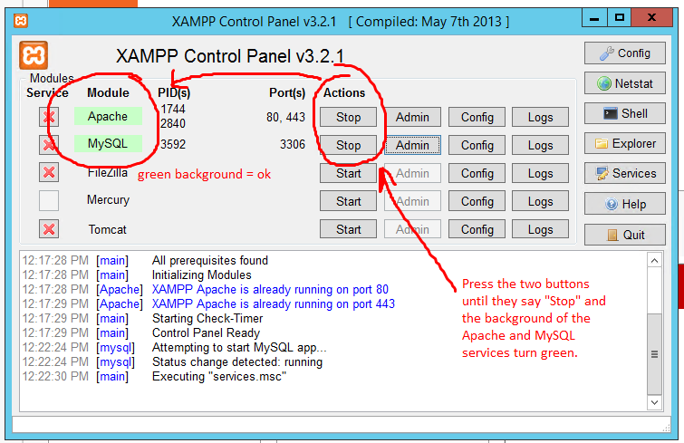

# How to restart

This section describes how to restart data gathering in the unfortunate event of a crash.

## blablabla

# Pre-Setup

This section describes the setup from scratch, up to the point of being ready for a (re)start of a group of Tweet Listeners.

## The Virtual Machine
The setup for tweet gathering was done on 30-09-2015 using [Microsoft Azure](https://portal.azure.com) services. On the platform, a virtual machine (classic) (this type is available when choosing what type of virtual machine to create in the Azure portal menu, but does not seem to be documented online) was set up on the A0-A3 tiers, each of which having the following specifications:

- A0 - 0.25 Cores, 750 MB RAM
- A1 - 1 Core, 1.75 GB RAM
- A2 - 2 Cores, 3.5 GB RAM
- A3 - 4 Cores, 7 GB RAM

The test was performed on A0, A1 and then A3, because higher performance seemed to be needed the more TweetListeners were active.

## The database
Setting up an online database was not planned properly, and therefore a local database was installed on the virtual machine with [xampp](https://www.apachefriends.org/index.html). The machine offers local storage of about 120 GB on the local disk, therefore it should be plenty for the database requirements of 20 initial tweet listeners (which based on previous experience should be less than 500 MB).

Apart from the local database, tweets are also saved in a backup .txt file in the folder of each of the TweetListeners. This is done as a safety backup in case there are any problems with the database. So far it has always proved useful to have it.

## Software/storage setup

The TweetListener is currently built in such a way that it is impossible (for an unknown reason) to start multiple instances of it. Therefore, the solution is to copy the program into multiple locations and run it as separate programs. This setup is made on the desktop of the VM so the user whose task is to restart does not have to set anything else up. The log and backup tweet files are stored in the same folder as the duplicate TweetListeners.

In the root folder of all the TweetListeners there are multiple batch files that allow control over execution of multiple programs. The "run oct-dec games.bat" is the most important, this runs all the programs and configures their settings for each game. The "copy Release into X folders" sets up the folder structure if there is any update to the software (old folders need to be deleted, the new software version placed in a folder called "Release" and then the batch file copies it X times, based on user input). Finally, a useful utility is the "kill all tweetlisteners.bat" which simply stops all processes named "WPFTwitter.exe", which is the current name of the actual program.

## Startup procedure

This section allows an inexperienced user to successfully start data gathering with minimal configuration options.

- Step 1. Starting up the virtual machine
  - The virtual machine (VM) must be accessed through the Azure portal or a Remote Desktop Connection provided from the portal beforehand. Once a machine is setup, the connection can be accessed from anywhere with the correct credentials. For the current configuration, the username and password are: `horatiu665` and `Twitter665`. All programs needed for running data gathering are available on the desktop of the VM.
  
- Step 1.1. Make sure the local server and database is running, by checking the XAMPP control panel from the icon in the lower right corner. Apache and MySQL should be running as seen in the image below. If there is no icon, please start XAMPP manually from the Start menu.

  
- Step 2. Setup the folder structure
  - Create a folder where all the applications will be. Currently, this is the folder TweetListeners on the desktop
  - Inside this folder, use the batch file called "run oct-dec games.bat", which is the only file needed to start data gathering for all games. Inside it, the configuration settings are already set up for each game, according to the specifications detailed in the code itself (this should at some point be moved on the wiki)
  - Note that the batch file is not updated when the settings are changed inside the TweetListener software. As a result, after tweaking the settings in the software, please be sure to change the .bat file if you want those changes to be available after a potential restart. This should not be required unless the changes in the software are significant and unless a restart is required using the batch file.
  
- Step 3. Run the file "run oct-dec games.bat" and make sure all the expected TweetListener windows are open, one for each game.
  - the windows will be named accordingly, so a mouse-hover over the icons on the task bar on the bottom of the screen should be enough.
  
- (optional) Step 4. Check each individual TweetListener instance by looking at the Log window in each of them. 
  - This step might be intense old-chineseman work. A future version of the software should ideally have a much better interface for running/verifying multiple streams at a glance.
  - How to check if streams are running: Is the last Log message something along the lines of "Stream started successfully" and "Rest Gathering started/completed"? Then the stream is running. The stream is not running only when there is a log message "Stream disconnected" after the latest "Stream started successfully".
  
# Process log
*Due to the A1 tier and the fact that the VM has only one core, starting 24 tweet listeners completely froze the computer. At a glance, it was obvious that the data gathering did not work as well, because there was an error with the database connection. This must be fixed and tested before the proper gathering can be started.*

The fix came in the form of creating some more timed retries in the application (i.e. when an error came from Twitter, a retry is attempted after a second or so, and the same goes for errors from the database system or other potential problems). Another major change was upgrading to the A3 tier, which provides 14 GB RAM and 4 cores to the VM. This change allowed the machine to be much more responsive when all the applications were started simultaneously. Another option attempted was to start the applications 12-at-a-time, therefore reducing the initial workload and allowing them to stabilize before the others were started, which resulted in a stable configuration where all the applications were started.

The problem now is to observe if the applications will run safely over a period of a few days. The restart procedure is simply running the batch file again, and the data gathering should take care of itself.

**3 days** have passed since gathering started. The VM has been running at 100% CPU for the past 2 days but surprisingly it is still somewhat responsive and all the programs are running. Unfortunately, none of the TweetListeners were able to send any e-mails, probably due to the VM not allowing such connections to be made (an error was received about the server response being 5.5.1. Authentication required). After a simple check for the raw numbers of tweets saved in the database, it is clear that some games are being given preferential treatment by the machine by receiving more CPU time than others, and therefore gathering more tweets than others. For example, halo5 gathered 12000 tweets in 3 days whereas dragon ball z only gathered 9 - and its release date is about 1 month sooner. Even though the first game is much more popular, this is suspicious, and at a closer look it appears that the application registered 62 tweets saved, the text file saved something like 20 tweets, but in the database only 9 managed to get through. The amount of data being missed is impossible to find out, as the stream simply sends messages in its own rhythm, and the application is capturing them at its own pace, not knowing that it might be too slow for the incoming data.

A solution for this might be to attempt improving the quality of the VM even further, or starting up multiple VMs and placing smaller loads on each (but then the setup operations must be done twice). Another solution is to redesign the software but as we decided that is time consuming and not worthwhile atm.

## List of games, release dates and queries

The list of games is based on the Wikipedia page [2015 in video gaming] (https://en.wikipedia.org/wiki/2015_in_video_gaming#Game_releases)

[This is a work in progress document where the games being searched for are described and the queries prepared](https://docs.google.com/spreadsheets/d/1ZXYjN8EHy2IchDqg0WT9960YriWKkpUA8guh68HA8C8/edit#gid=0)
