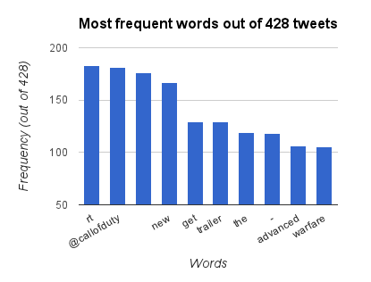
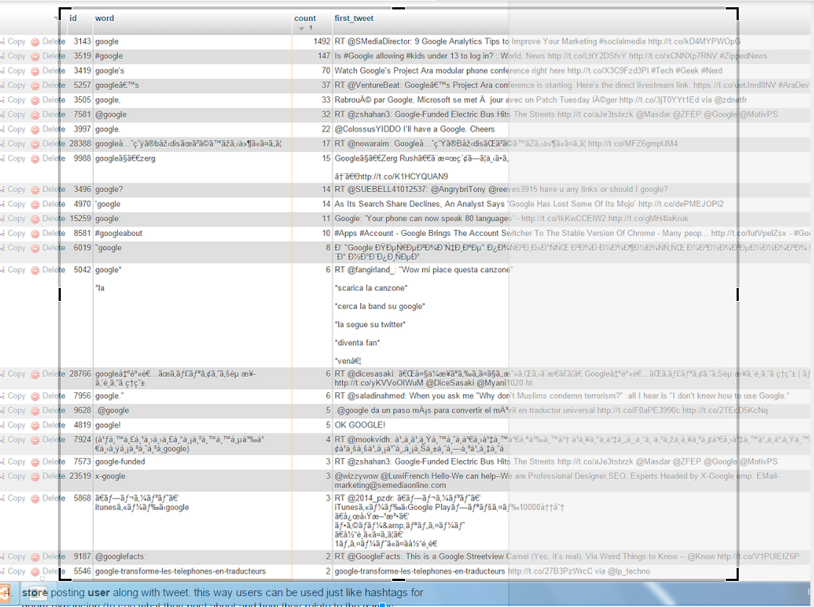

[Prev](streamingTest1.md)[Next](streamingTest3.md)

# TweetListener overnight test (13-01-2015)
Here are notes about the first prototype test. Many things were missing and were not thought of, but it gives a lot of good feedback to see what problems were encountered. The most important section of this test is the problems section, where we have hints for what must be changed for a better test.

## App specifications

- console app using Tweetinvi C# library
- connection to twitter streaming with filter. for this test, callofduty
- connection to database at hivemindcloud.hostoi.com (free web host with some unknown but likely limitations)
- database storage made using post requests at two php addresses - one saves tweets as words and one saves entire tweets.
- app logs events and times, saves them in a txt file. also logs errors if they occur.

## Test specifications and raw results
- app ran between 13-01-2015 18:16:11 and 14-01-2015 09:12:14 (~15h)
- logging stopped at 13-01-2015 20:04:13 after an error with the Tweetinvi streaming connection:
  - ``` Exception: System.IO.IOException: Unable to read data from the transport connection: A connection attempt failed because the connected party did not properly respond after a period of time, or established connection failed because connected host has failed to respond. ---> System.Net.Sockets.SocketException: A connection attempt failed because the connected party did not properly respond after a period of time, or established connection failed because connected host has failed to respond
   at System.Net.Sockets.Socket.Receive(Byte[] buffer, Int32 offset, Int32 size, SocketFlags socketFlags)
   at System.Net.Sockets.NetworkStream.Read(Byte[] buffer, Int32 offset, Int32 size)
   --- End of inner exception stack trace ---
   at Microsoft.Runtime.CompilerServices.TaskAwaiter.ThrowForNonSuccess(Task task)
   at Microsoft.Runtime.CompilerServices.TaskAwaiter.HandleNonSuccess(Task task)
   at Microsoft.Runtime.CompilerServices.TaskAwaiter`1.GetResult()
   at Tweetinvi.Streams.Helpers.StreamResultGenerator.<StartStreamAsync>d__7.MoveNext() ```
   
  ` Counters: 0 500 0 0 0 1 1 0 0 500 0 0 0 0  at time 13-01-2015 20:04:13 `
- There were 500 JSON objects transmitted, of which 500 were tweets; 1 stream start message and 1 stream stop message.
for each tweet from the 429th to the 500th, there was an error because the connection to the free webhost was interrupted (some time between 13-01-2015 19:33:10-19:33:38)
  - ``` System.Net.WebException: Unable to connect to the remote server ---> System.Net.Sockets.SocketException: A connection attempt failed because the connected party did not properly respond after a period of time, or established connection failed because connected host has failed to respond 31.170.161.16:80
   at System.Net.Sockets.Socket.DoConnect(EndPoint endPointSnapshot, SocketAddress socketAddress)
   at System.Net.ServicePoint.ConnectSocketInternal(Boolean connectFailure, Socket s4, Socket s6, Socket& socket, IPAddress& address, ConnectSocketState state, IAsyncResult asyncResult, Exception& exception)
   --- End of inner exception stack trace ---
   at System.Net.HttpWebRequest.GetRequestStream(TransportContext& context)
   at System.Net.HttpWebRequest.GetRequestStream()
   at ConsoleTwitter.Program.SaveToPhp(String message) in d:\HHH\TwitterProject\ConsoleTwitter\ConsoleTwitter\Program.cs:line 415
   at ConsoleTwitter.Program.SendTweetToDatabase(ITweet tweet) in d:\HHH\TwitterProject\ConsoleTwitter\ConsoleTwitter\Program.cs:line 351 ```
 
  ` Counters: 0 429 0 0 0 1 0 0 0 428 0 0 0 0  at time 13-01-2015 19:33:38 `
- 428 tweets were saved, totalling 1200 “unique” words (“#callofduty”, “callofduty” and “callofduty:” were all different words)

## Simple analysis of results
Interesting results can be seen, some tweets are repetitive and posted every 15 minutes, such as: `“RT @MLG: Come check out some @CallofDuty: Advanced Warfare Ranked Play on http://t.co/11f2ZFrKbq! http://t.co/D1YPpvwyGL”` - this one was posted insanely much.
results cannot be judged completely accurately because of similar tags that are treated differently because of punctuation or string escaping. Results can be found in spreadsheets:
- wordscount 
https://drive.google.com/open?id=1tiT03qaHk51Y-v9IpnTV0D1blEEvaRKXlYcAZzI-5pI&authuser=0
- tweets 
https://drive.google.com/open?id=1URuFF1xDvC2SZ3kX5zGwCny8Z93C1ppl7bBQeAwmuTk&authuser=0

- here is a chart from Google Sheets just for fun

  

### Test problems and improvement ideas
- **Most important: handle disconnects**. Both from Twitter streaming, and from free webhost.
disconnect of Tweetinvi stream is handled, remains to be seen if it really works.
  - free webhost disconnect has not yet been handled, however there is not much to handle because connection is made and closed every time something is to be sent. temp solution is to try multiple times to send stuff to the db when there is an error, and after 100 attempts give up, meanwhile still sending all the new data. this might become slightly chaotic but hopefully it will work.
- URL encode messages sent to server, because we are losing data when, for example, the char “&” is used. most likely also “?” and “=” and so on.
  - solved
- handle similar words somehow: callofduty, #callofduty and “callofduty:” should probably be the same. or maybe hashtag should be different
  - interesting note on this. Check out how many words contain google when the query actually is “google”

  

- store posting user along with tweet. this way users can be used just like hashtags for query expansion (to see what they post about and how they relate to the games monitored). actually store all data about tweet since it is not so big and can prove useful
- tweets can be recovered if tweet id is known. https://dev.twitter.com/rest/reference/get/statuses/show/%3Aid 
- try running the test on the local server instead of online. even with the memory limits it still might have a better performance, based on tests with queries like “google” which returned maybe even 10 tweets per second on localhost, and max. 3 tweets per second online.
  - solved, prediction accurate.

  [Prev](streamingTest1.md)[Next](streamingTest3.md)
